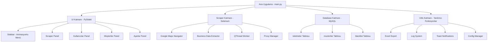
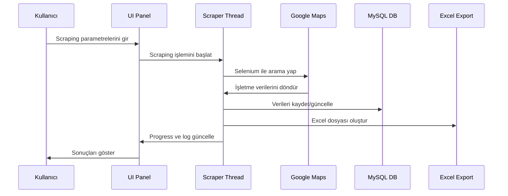

# Google Maps Scraper - Sistem Mimarisi

## Uygulama Genel Yapısı



## Veri Akışı



## Klasör Yapısı

```
google_maps_scraper/
├── main.py                 # Ana uygulama giriş noktası
├── requirements.txt        # Python bağımlılıkları
├── config.json            # Uygulama ayarları
├── ui/                    # PySide6 UI bileşenleri
│   ├── __init__.py
│   ├── main_window.py     # Ana pencere
│   ├── sidebar.py         # Sidebar bileşeni
│   ├── panels/            # Panel bileşenleri
│   │   ├── scraper_panel.py
│   │   ├── users_panel.py
│   │   ├── customers_panel.py
│   │   └── settings_panel.py
│   └── styles/            # QSS stil dosyaları
│       └── dark_theme.qss
├── scraper/               # Scraping modülü
│   ├── __init__.py
│   ├── google_maps_scraper.py
│   ├── scraper_worker.py  # QThread worker
│   └── proxy_manager.py
├── database/              # Veritabanı modülü
│   ├── __init__.py
│   ├── connection.py      # DB bağlantısı
│   ├── models.py          # Veri modelleri
│   └── schema.sql         # Tablo şemaları
├── utils/                 # Yardımcı fonksiyonlar
│   ├── __init__.py
│   ├── excel_export.py
│   ├── logger.py
│   ├── toast.py
│   └── config.py
└── assets/                # Görsel kaynaklar
    ├── icons/
    └── images/
```

## Teknik Detaylar

### Gerekli Python Paketleri
- PySide6 (GUI framework)
- selenium (Web scraping)
- mysql-connector-python (MySQL bağlantısı)
- openpyxl (Excel işlemleri)
- requests (HTTP istekleri)
- beautifulsoup4 (HTML parsing)

### Önemli Özellikler
1. **Sidebar Animasyonu**: QPropertyAnimation ile 220px ↔ 60px geçiş
2. **Dark Theme**: Tam koyu tema QSS ile
3. **Thread Safety**: Scraping işlemleri QThread'de
4. **Model/View**: Tablolar için Qt Model/View mimarisi
5. **Toast Notifications**: Sağ üst köşede bildirimler
6. **Responsive Design**: Pencere boyutuna uyum